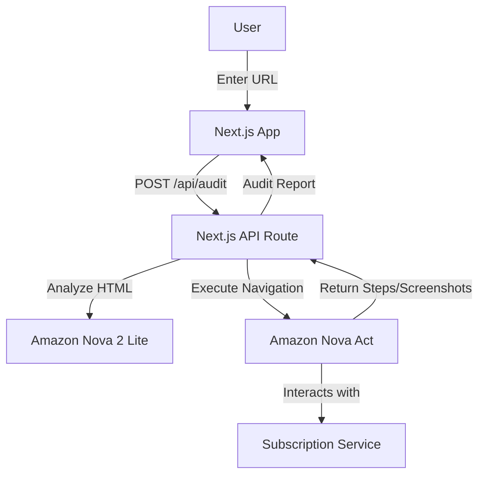

# SubScout Implementation Plan 🕵️‍♂️

## Overview

SubScout demonstrates the power of **Agentic AI** in consumer protection. By leveraging **Amazon Nova Act**, we automate the tedious process of navigating cancellation flows designed to retain users through "dark patterns".

## Architecture

## AI Models Strategy

### 1. Amazon Nova 2 Lite (Reasoning)

- **Role**: The "Brain".
- **Task**:
  - Parse minimal HTML snapshots to identify UI elements.
  - Classify text as "Dark Pattern" (e.g. guilt-tripping language, hidden links).
  - Decide next action for the agent.
- **Why Nova 2 Lite?**: Speed and cost-effectiveness for rapid reasoning loops.

### 2. Amazon Nova Act (Action)

- **Role**: The "Hands".
- **Task**:
  - Manage browser session state.
  - Execute clicks, form fills, and navigation events.
  - Handle authentications (simulated for verified demo flows).

## Workflow Logic

1. **Initial Scan**:
   - The agent visits the `/account` or `/cancel` page.
   - Using **Nova 2 Lite**, it identifies the "Cancellation" entry point.
2. **Navigation Loop**:
   - Agent clicks "Cancel".
   - System takes a screenshot/DOM snapshot.
   - **Nova 2 Lite** analyzes the new state:
     - Is it a confirmation page? -> **Success**.
     - Is it a "Are you sure?" modal? -> **Click "Yes"**.
     - Is it a "Pause instead?" offer? -> **Decline**.
     - Is it a phone number requirement? -> **Flag as "Hard"**.

3. **Report Generation**:
   - Compile the path taken into a step-by-step guide.
   - Calculate "Friction Score" based on clicks required vs. industry standard.

## Future Improvements

- **Voice Mode**: Use **Nova 2 Sonic** to navigate via voice commands ("Just cancel my gym membership").
- **Multi-Agent**: Parallel agents checking multiple subscriptions at once.
